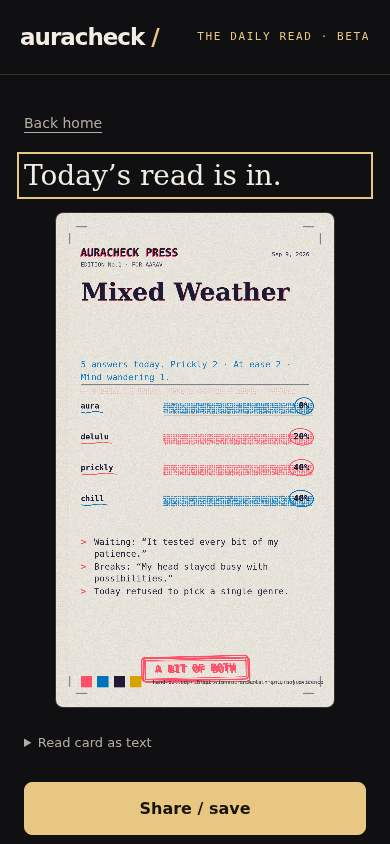

# AuraCheck

A mood-card generator that lives entirely in the browser. Answer five questions about your day, get a shareable 1080x1920 card that reads you for it. No account, no server, no tracking — everything stays in your browser's local storage.

Live at **https://kaiser0733.github.io/auracheck/**



## What it does

You check in with how today felt. Five questions, drawn from a rotating bank of 28, all phrased about *today* rather than "your personality" — the read you get is a snapshot, not a diagnosis. Answers run through a small scoring engine that weighs four traits (aura, delulu, prickly, chill), picks the dominant one, and prints a card with your name, your percentages, and two of your own answers quoted back at you. The card export includes those quotes, so you get a warning before sharing.

The whole thing is a vanilla HTML/CSS/JS single page app. No framework, no build step, no npm install. It installs as a PWA and works offline after first load.

## Design notes

The card is drawn entirely in canvas code — paper texture, halftone shading, misregistration on the headline, a rubber stamp. No stock images, no AI-generated art. This was a deliberate response to early feedback that the first card design read as "AI slop"; the redesign process and reasoning are logged in DECISIONS.md if you want the full story.

Free tier is three cards a week, resetting Monday 00:00 IST. The app has no backend and no payments — quota lives in localStorage, and we treat it as a speed bump rather than a vault. A full security review (quota bypass vectors, injection sinks, storage corruption, service-worker staleness, clickjacking) was run before launch; the fixes from that review are in the test suite.

## Running it locally

Any static file server works:

```
python3 -m http.server 8480
```

Then open http://127.0.0.1:8480/. That's it — there's nothing to configure.

## Tests

Plain Node, no dependencies. The engine, quota math, storage layer, and code redemption each have their own suite:

```
node tests/test_store.js && node tests/test_honesty.js && node tests/test_codes.js
node tests/test_quota.js && node tests/test_engine.js
node --test tests/*.test.cjs
```

`tests/browser_smoke.py` drives a real Chromium over CDP for the end-to-end flow (selection, resume, quota, history, offline reload). It needs Python with the `websocket-client` package and a Chromium running with `--remote-debugging-port=9222`.

## Repository layout

```
index.html            single-page shell, all screens inline
js/questions.js       28-question rotating bank
js/cards.js           12 card templates, 3 per trait
js/engine.js          scoring: answers -> trait -> card payload (pure logic)
js/render.js          canvas card renderer, 1080x1920
js/quota.js           weekly quota + reset codes
js/store.js           localStorage wrapper with corruption self-repair
js/share.js           Web Share API + download fallback
js/app.js             screen wiring and flow
sw.js                 service worker, cache-first offline shell
tests/                unit suites + browser smoke
DECISIONS.md          design log: why things are the way they are
```

## License

All rights reserved. The code is visible for review, but you need written permission to use, modify, or redistribute it. Contact before doing anything with it.
